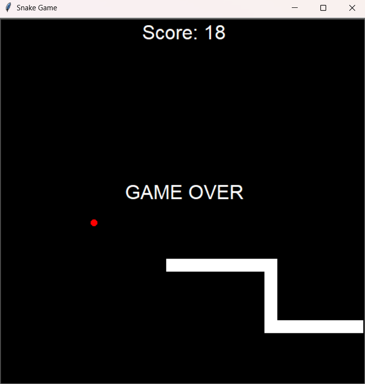

# Snake Game

A simple Snake game built with Python.

## Gameplay

- Use arrow keys to control the snake's direction
- Eat the food (shown as a special tile) to grow your snake
- Avoid hitting the walls or your own body
- Each food consumed increases your score and snake length

